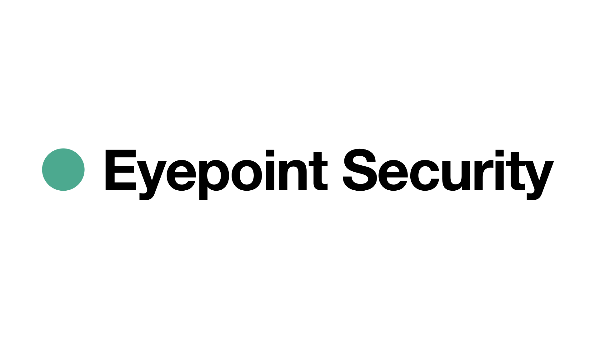

# Eyepoint Security: Air-Gap Protection for Remote Work

**We deliver air-gap security for remote endpoints by ensuring that data is only decrypted at the user’s eye level.**

## The Problem

Endpoint devices are vulnerable—attackers can take over apps or the operating system, even when strict security policies are in place. Some organizations value the flexibility of remote work, but risk data leaks from endpoint devices. Others sacrifice remote work benefits and enforce strict air-gap policies to protect sensitive information.

## Our Solution

Our patented **augmented reality (AR) glasses** combine air-gap security with the flexibility of remote work. Data remains encrypted on a user’s laptop or smartphone and only becomes readable once it reaches the AR glasses—never passing through the operating system in plaintext. This approach prevents attackers from seeing confidential data, even if they gain control over the endpoint.

In addition, the AR environment keeps user input (such as signing documents or interacting with web apps) secure, preventing interception and replay attacks.

## How It Works

1. **Encrypted Display.** When users open or view confidential data, the application displays a **visually encrypted** version on-screen.

2. **AR Decryption.** Our AR glasses detect and match encryption keys, then decrypt the data and overlay clear text over the application screen.

3. **Biometric Key Generation.** Each user’s biometric data helps generate unique encryption keys so only the rightful wearer can access the information. If the glasses are lost or stolen, the data remains protected.

4. **True Air-Gap.** The AR glasses are isolated from the network, making remote compromise virtually impossible. Decryption happens exclusively “at eye level,” so sensitive data never appears in plaintext at the endpoint or over the network.

Employees can open sensitive documents on any laptop, yet the text remains encrypted until viewed through our AR glasses, preventing unauthorized screenshots or key logging.

## **The Market Opportunity**

Some organizations prefer the flexibility of remote work, while others prefer strict air-gap policies. Each approach has advantages and disadvantages:

- **Remote work networks** offer high productivity but can lead to data leaks.
- **Closed air-gap networks** minimize leaks but also limit productivity.

Our solution provides **both** high productivity and low risk of data leaks, serving organizations that currently prefer air-gap networks and those striving to enable safe remote work.

## About Us

### Lior Shalev

<a href="https://www.linkedin.com/in/liorshalev/" target="_blank">https://www.linkedin.com/in/liorshalev/</a>

Lior Shalev is a software developer with extensive experience designing and delivering high-performance, cross-platform solutions on Windows, Linux, Android, iOS, and cloud environments. Adept at building robust software pipelines and leading teams. Recognized for driving innovation in cybersecurity, large-scale distributed systems, and embedded software projects.

### Dr. Orna Yehuda Abramson

<a href="https://www.linkedin.com/in/droya/" target="_blank">https://www.linkedin.com/in/droya/</a>

Dr. Orna Yehuda Abramson is an experienced startup professional, innovation researcher, and development consultant. With a background in cognitive & behavioral psychology and data-driven strategy, she specializes in applying cognitive and behavioral science to cybersecurity challenges, enhancing user security awareness, and driving innovative solutions in the industry.

### Roy Melzer

<a href="https://www.linkedin.com/in/roymelzer/" target="_blank">https://www.linkedin.com/in/roymelzer/</a>

Roy Melzer is a seasoned Patent Portfolio Manager, IP Consultant, and Patent Leader. He specializes in protecting innovation, optimizing patent portfolios, and ensuring a strong competitive edge. His strategic insights help drive our IP roadmap, safeguard our technology, and enhance market positioning.

## Join Us!

We’re redefining endpoint security for a remote-first world. Protect your data where it matters most: at the user’s eye level.

[info@eyepoint-sec.com](mailto:info@eyepoint-sec.com)

